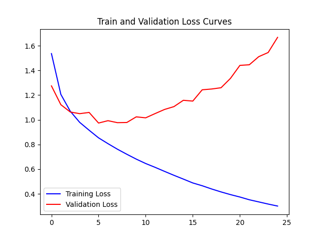

Autonomy Bootcamp Submission

This program uses a ___ (network topology). 

Any network topology may be used for this bootcamp. 

In addition to the Python script, include a plot of both training and validation losses over epochs (matplotlib.pyplot can be used for this). The code should:

Follow our style guide

Have comments for each process explaining what is occurring at that step and why

Actually train

Accuracy should be greater

When submitting, please include an image of the plots that you produced, as well as a text file of your terminal output (or a screenshot of your final accuracy).

