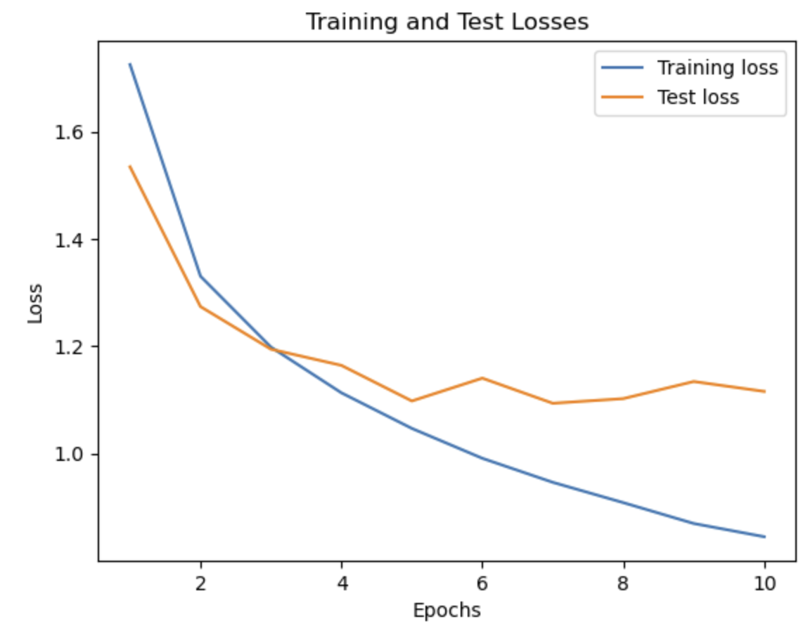
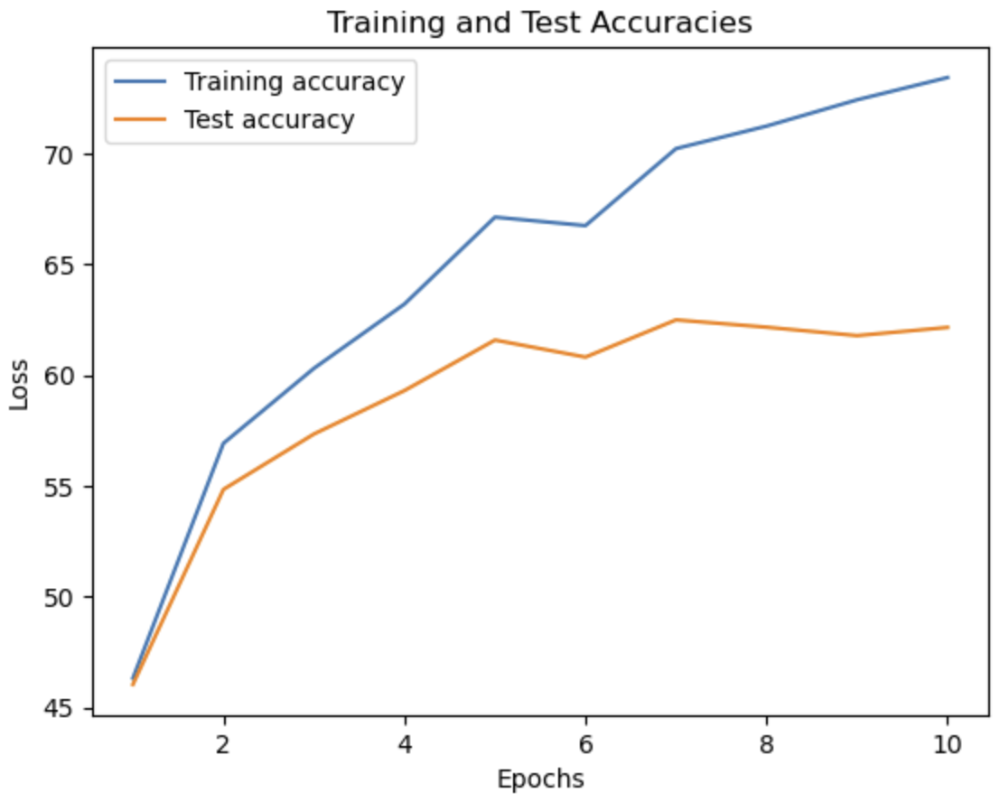

# Autonomy Bootcamp Submission

This program uses a _(type)_ (network topology). 

> The PEP 8 and Pylint styles are used to format this code.

## Training and Test Loss and Accuracy Curves

 

### Final accuracy achieved:
![] ()

Actually train

Accuracy should be greater

