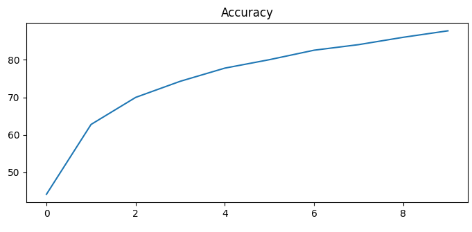
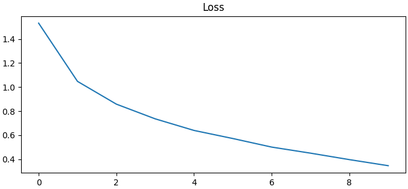
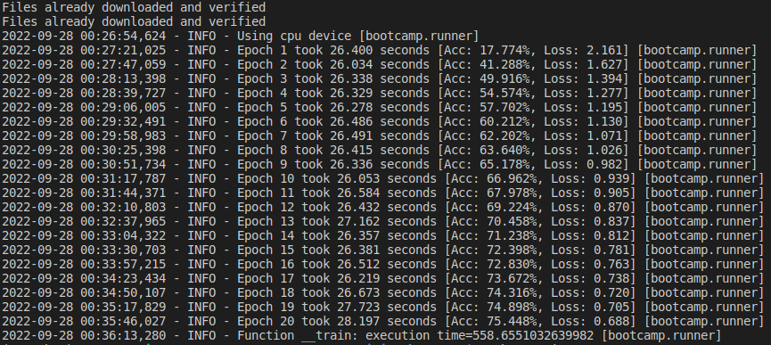
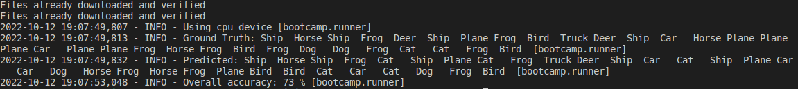

Repo for submitting Computer Vision bootcamps.

For more details see [CV Bootcamp on Confluence](https://uwarg-docs.atlassian.net/wiki/spaces/BOOT/pages/1544290340/Computer-Vision+Bootcamp).

Bootcamp has been completed.

running `python3 main.py` from the base repo directory will give instructions on running this bootcamp.

For code organization, three classes have been put into bootcamp/ :

DataManager:
 - Handles downloading and verifying that the CIFAR10 dataset is downloaded and creating the dataset loaders
 - Also stores the the labels of all the classes

NeuralNetwork:
 - Defines the structure of the nerual network, and handles stepping a training step forwards

Runner:
 - Handles the training and testing of the neural network, based on if the `train` or `test` argument was passed.

Accuracy and Loss graph as expected during training:

Logs during training phase:

Logs during testing phase:

