# Autonomy Bootcamp Submission

This program trains a convolutional neural net on the CIFAR10 dataset.
> The PEP 8 and Pylint styles are used to format this code.

## Final Training and Test Loss and Accuracy Curves
  

### Final accuracy achieved
 

### Program output
```
CUDA is not available.  Training on CPU ...

Files already downloaded and verified
Files already downloaded and verified

Start Training

[Epoch: 1]
Training loss: 1.461
Train accuracy: 60.532
----------
Test loss: 1.148
Test accuracy: 59.68
----------

[Epoch: 2]
Training loss: 0.893
Train accuracy: 75.218
----------
Test loss: 0.764
Test accuracy: 73.61
----------

[Epoch: 3]
Training loss: 0.690
Train accuracy: 80.542
----------
Test loss: 0.667
Test accuracy: 76.53
----------

[Epoch: 4]
Training loss: 0.560
Train accuracy: 85.576
----------
Test loss: 0.577
Test accuracy: 80.07
----------

[Epoch: 5]
Training loss: 0.470
Train accuracy: 86.09
----------
Test loss: 0.599
Test accuracy: 79.34
----------

[Epoch: 6]
Training loss: 0.392
Train accuracy: 91.166
----------
Test loss: 0.523
Test accuracy: 82.21
----------

[Epoch: 7]
Training loss: 0.321
Train accuracy: 92.472
----------
Test loss: 0.523
Test accuracy: 82.43
----------

[Epoch: 8]
Training loss: 0.264
Train accuracy: 94.576
----------
Test loss: 0.531
Test accuracy: 83.13
----------

[Epoch: 9]
Training loss: 0.212
Train accuracy: 96.364
----------
Test loss: 0.534
Test accuracy: 82.89
----------

[Epoch: 10]
Training loss: 0.172
Train accuracy: 95.756
----------
Test loss: 0.600
Test accuracy: 82.31
----------

[Epoch: 11]
Training loss: 0.139
Train accuracy: 98.248
----------
Test loss: 0.551
Test accuracy: 84.09
----------

[Epoch: 12]
Training loss: 0.115
Train accuracy: 98.41
----------
Test loss: 0.582
Test accuracy: 83.85
----------

[Epoch: 13]
Training loss: 0.095
Train accuracy: 98.866
----------
Test loss: 0.632
Test accuracy: 84.11
----------

[Epoch: 14]
Training loss: 0.082
Train accuracy: 99.25
----------
Test loss: 0.591
Test accuracy: 84.13
----------

[Epoch: 15]
Training loss: 0.066
Train accuracy: 99.03
----------
Test loss: 0.652
Test accuracy: 83.98
----------

[Epoch: 16]
Training loss: 0.055
Train accuracy: 99.352
----------
Test loss: 0.667
Test accuracy: 84.34
----------

[Epoch: 17]
Training loss: 0.053
Train accuracy: 99.698
----------
Test loss: 0.631
Test accuracy: 85.01
----------

[Epoch: 18]
Training loss: 0.047
Train accuracy: 99.518
----------
Test loss: 0.677
Test accuracy: 84.53
----------

[Epoch: 19]
Training loss: 0.044
Train accuracy: 99.606
----------
Test loss: 0.686
Test accuracy: 84.3
----------

[Epoch: 20]
Training loss: 0.037
Train accuracy: 99.842
----------
Test loss: 0.675
Test accuracy: 85.35
----------

[Epoch: 21]
Training loss: 0.034
Train accuracy: 99.826
----------
Test loss: 0.699
Test accuracy: 84.78
----------

[Epoch: 22]
Training loss: 0.032
Train accuracy: 99.754
----------
Test loss: 0.727
Test accuracy: 84.63
----------

[Epoch: 23]
Training loss: 0.030
Train accuracy: 99.324
----------
Test loss: 0.798
Test accuracy: 83.53
----------

[Epoch: 24]
Training loss: 0.026
Train accuracy: 99.788
----------
Test loss: 0.742
Test accuracy: 84.81
----------

[Epoch: 25]
Training loss: 0.026
Train accuracy: 99.704
----------
Test loss: 0.764
Test accuracy: 84.66
----------

[Epoch: 26]
Training loss: 0.023
Train accuracy: 99.852
----------
Test loss: 0.752
Test accuracy: 85.1
----------

[Epoch: 27]
Training loss: 0.020
Train accuracy: 99.892
----------
Test loss: 0.785
Test accuracy: 84.9
----------

[Epoch: 28]
Training loss: 0.019
Train accuracy: 99.314
----------
Test loss: 0.828
Test accuracy: 83.56
----------

[Epoch: 29]
Training loss: 0.020
Train accuracy: 99.786
----------
Test loss: 0.801
Test accuracy: 84.7
----------

[Epoch: 30]
Training loss: 0.017
Train accuracy: 99.858
----------
Test loss: 0.777
Test accuracy: 84.99
----------

Finished Training

Training time: 15934.6599641 seconds

Accuracy of the network on the 10000 test images: 84 %

Accuracy for each class:

plane: 90.3 %
car  : 92.6 %
bird : 79.8 %
cat  : 69.7 %
deer : 77.5 %
dog  : 76.6 %
frog : 90.1 %
horse: 92.6 %
ship : 89.5 %
truck: 91.2 %
```

## Training process
__Attempt 1:__
```
class Net(nn.Module):
    def __init__(self):
        super().__init__()
        self.conv1 = nn.Conv2d(3, 6, 5)
        self.pool = nn.MaxPool2d(2, 2)
        self.conv2 = nn.Conv2d(6, 16, 5)
        self.fc1 = nn.Linear(16 * 5 * 5, 120)
        self.fc2 = nn.Linear(120, 84)
        self.fc3 = nn.Linear(84, 10)

    def forward(self, x):
        x = self.pool(F.relu(self.conv1(x)))
        x = self.pool(F.relu(self.conv2(x)))
          # flatten all dimensions except batch
        x = F.relu(self.fc1(x))
        x = F.relu(self.fc2(x))
        x = self.fc3(x)
        return x
```
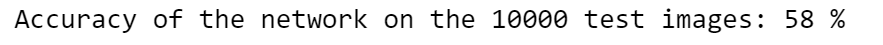 
 
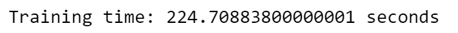 
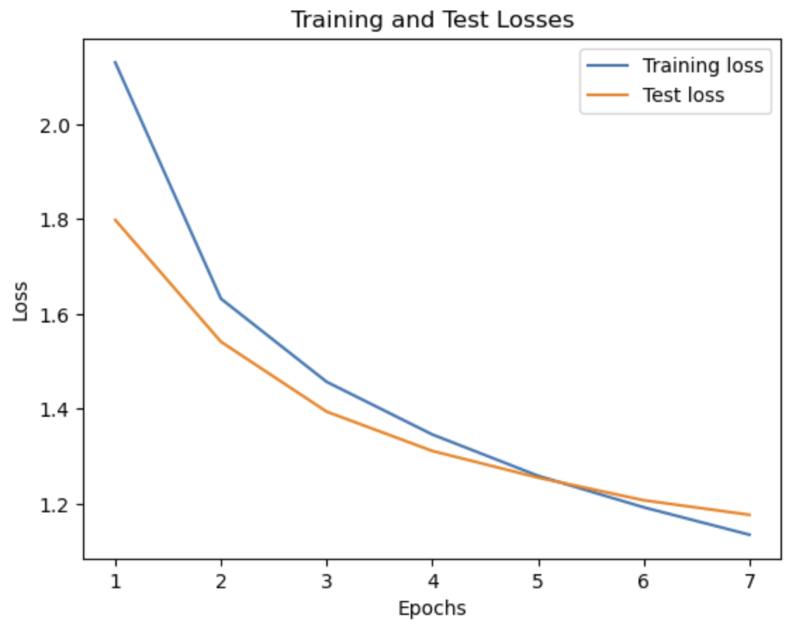 

This model gives an accuracy of 58%. Evidently, there is room for improvement.
In the next few attempts, the model and the hyperparameters are tweaked to increase the score.

__Attempt 2:__
```
class Net(nn.Module):
    def __init__(self):
        super(Net, self).__init__()
        # convolutional layer
        self.conv1 = nn.Conv2d(3, 16, 3, padding=1)
        self.conv2 = nn.Conv2d(16, 32, 3, padding=1)
        self.conv3 = nn.Conv2d(32, 64, 3, padding=1)
        # max pooling layer
        self.pool = nn.MaxPool2d(2, 2)
        # fully connected layers
        self.fc1 = nn.Linear(64 * 4 * 4, 512)
        self.fc2 = nn.Linear(512, 64)
        self.fc3 = nn.Linear(64, 10)
        # dropout
        self.dropout = nn.Dropout(p=.5)

    def forward(self, x):
        # add sequence of convolutional and max pooling layers
        x = self.pool(F.relu(self.conv1(x)))
        x = self.pool(F.relu(self.conv2(x)))
        x = self.pool(F.relu(self.conv3(x)))
        # flattening
        x = x.view(-1, 64 * 4 * 4)
        # fully connected layers
        x = self.dropout(F.relu(self.fc1(x)))
        x = self.dropout(F.relu(self.fc2(x)))
        x = self.fc3(x)
        return x
```
This attempt uses a sequential CNN with more layers and a larger batch size along with a defined flattening layer.
The channels are set to 3 and 16, 16 and 32, and 32 and 64 for the first, second, and third Convolutional Layers, respectively.
In the MaxPool layer, it is changed to downsample the input representation by taking the maximum value over the window defined by pool size for each dimension along the features axis. It also includes a 50% dropout layer to reduce overfitting.
The number of epochs are also adjusted to optimize accuracy. 

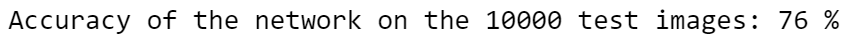 
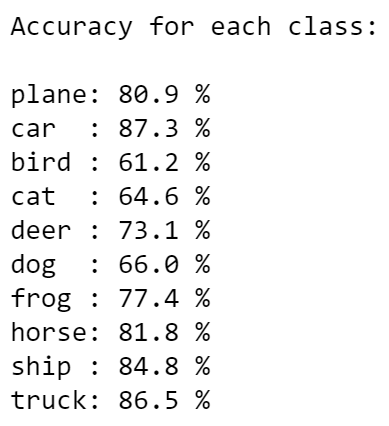 
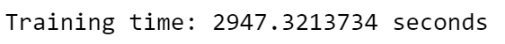 
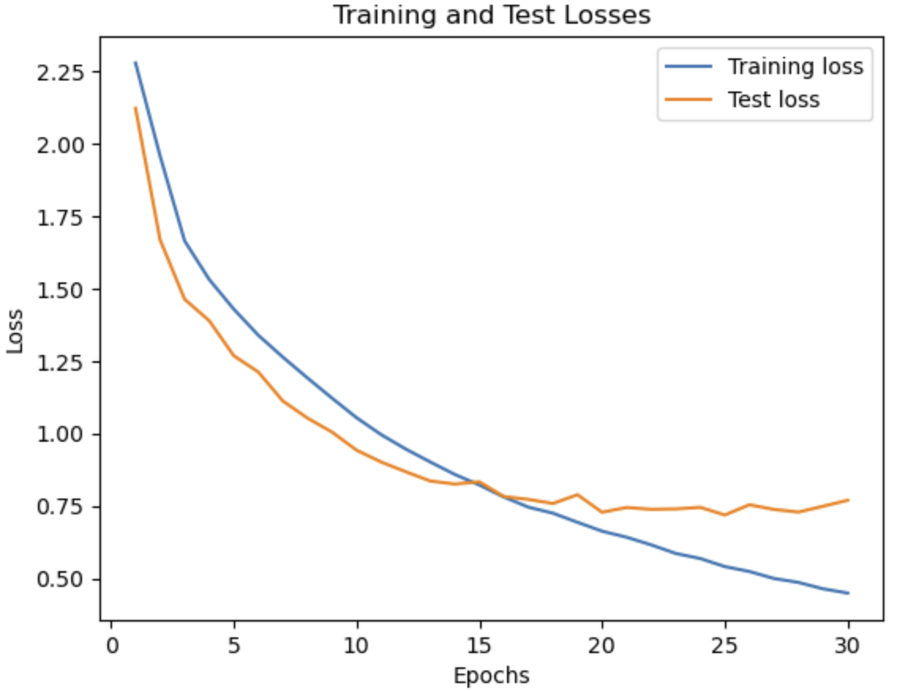 

These changes led us to an increase of 76% accuracy.
To increase the accuracy more, the next attempt tweaks the hyperparameters more.

__Attempt 3:__
```
class CNN(nn.Module):
   

    def __init__(self):
        
        super(CNN, self).__init__()

        self.conv_layer = nn.Sequential(

            # Conv Layer block 1
            nn.Conv2d(in_channels=3, out_channels=32, kernel_size=3, padding=1),
            nn.BatchNorm2d(32),
            nn.ReLU(inplace=True),
            nn.Conv2d(in_channels=32, out_channels=64, kernel_size=3, padding=1),
            nn.ReLU(inplace=True),
            nn.MaxPool2d(kernel_size=2, stride=2),

            # Conv Layer block 2
            nn.Conv2d(in_channels=64, out_channels=128, kernel_size=3, padding=1),
            nn.BatchNorm2d(128),
            nn.ReLU(inplace=True),
            nn.Conv2d(in_channels=128, out_channels=128, kernel_size=3, padding=1),
            nn.ReLU(inplace=True),
            nn.MaxPool2d(kernel_size=2, stride=2),
            nn.Dropout2d(p=0.05),

            # Conv Layer block 3
            nn.Conv2d(in_channels=128, out_channels=256, kernel_size=3, padding=1),
            nn.BatchNorm2d(256),
            nn.ReLU(inplace=True),
            nn.Conv2d(in_channels=256, out_channels=256, kernel_size=3, padding=1),
            nn.ReLU(inplace=True),
            nn.MaxPool2d(kernel_size=2, stride=2),
        )


        self.fc_layer = nn.Sequential(
            nn.Dropout(p=0.1),
            nn.Linear(4096, 1024),
            nn.ReLU(inplace=True),
            nn.Linear(1024, 512),
            nn.ReLU(inplace=True),
            nn.Dropout(p=0.1),
            nn.Linear(512, 10)
        )


    def forward(self, x):
        """Perform forward."""
        
        # conv layers
        x = self.conv_layer(x)
        
        # flatten
        x = x.view(x.size(0), -1)
        
        # fc layer
        x = self.fc_layer(x)

        return x
```
The revised model above has an increased amount of layers, and added Convolutional blocks that have a kernel size of 3. 
Channel sizes are also adjusted.

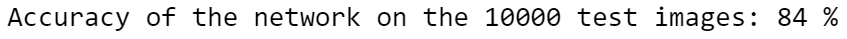 
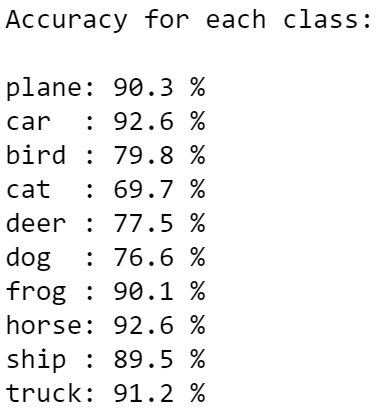 
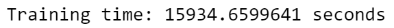 
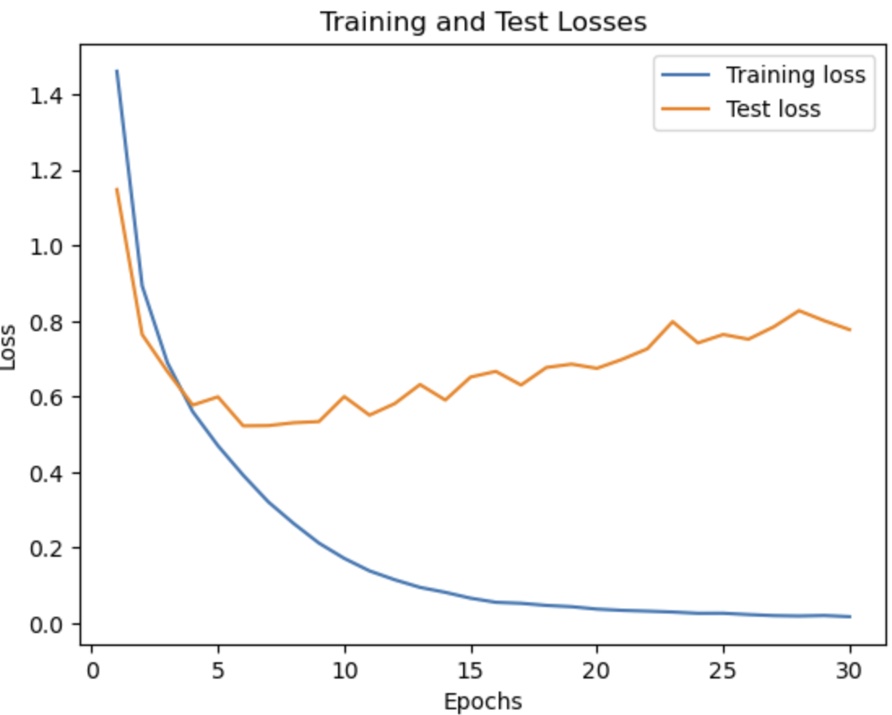 

Now the accuracy has improved to 84%. 
The batches in the previous models were too small in proportion to our large dataset.

### Model comparison

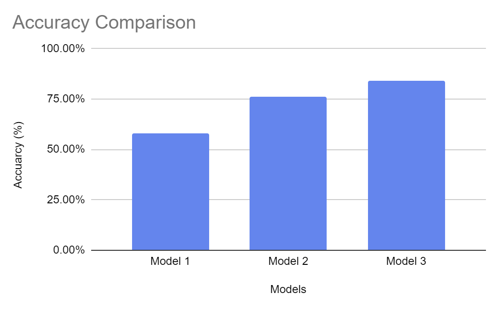 
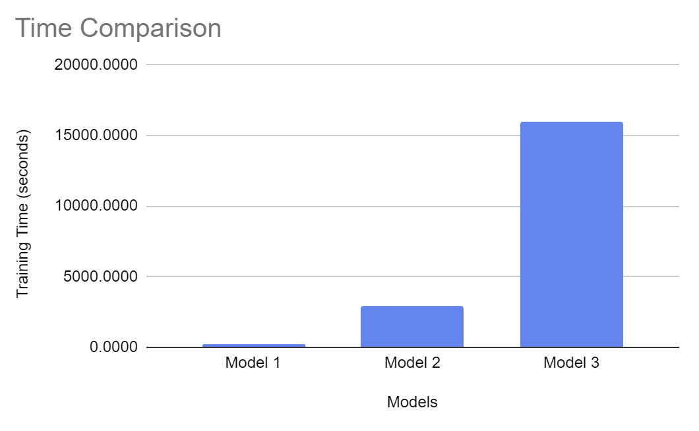 

### Challenges
1. __Feature extraction:__ Observe how the class accuracies consistently have lower accuracies for images of cats, dogs, and birds. This is likely because of these images have more colours, which suggests an issue in feature extraction. 
2. __Too many epochs:__ When the number of epochs is increased, the model overfits and the accuracy drops.
3. __Tuning hyperparameters:__ This is very time-consuming as training itself takes a very long time.
