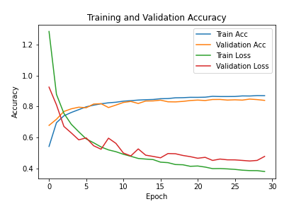

# CIFAR10-TensorFlow

## Description

This is an image classifier made using PyTorch.

Images were loaded from the CIFAR10 dataset and passed through CNN and dense layers after preprocessing. Batch normalization was used to improve computational efficiency, and dropout layers were added to minimize overfitting to training data.

## Applicaition

Image classification is a major branch of computer vision. It is relevant to quality control, facial recognition, and other use cases.

## Results

In model_v10, overfitting was lowest among model versions. This was accomplished by using dropout layers and tuning weight decay.

## Key Learnings

I learned of the value of regularization techniques such as dropout layers in image classification, as well as all CNN models. Adding dropout layers and using weight decay in the Adam optimizer resulted in significantly decreased overfitting. Prior to regularization, valitation accuracy was notably lower than trin accuracy.

## Future Considerations

The disadvantage of regularization is that train acuracy may decrease as a result. To reach accuracies nearer to 100% while still minimizing overfitting, I may try adding an increased number of layers to the CNN. To expand the dataset in use, I may apply image augmentations similar to as applied in my CIFAR10-TensorFlow classifer (https://github.com/IshmanM/CIFAR10-TensorFlow).